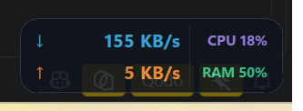

# NetSpeedTray

A tiny always-on-top network monitor for Windows 10/11 that shows live download and
upload speed — plus optional CPU and RAM load — in a translucent, rounded glass card
that sits in the corner of your screen.



No installer, no background service: it is a single Python file that samples `psutil`
once per second. The transparency slider fades the **card background only** — the speed
readings always stay crisp and fully readable, even at maximum transparency, thanks to a
dark text outline drawn behind every reading.

## What's new in 2.7.0

A big release focused on richer at-a-glance information, robustness on multi-monitor
setups, and accessibility:

- **Speed sparkline** — a tiny mini-chart of recent download/upload speed now lives in the
  hover tooltip, so you can see trends, not just the current value.
- **Custom ping target** — set any host:port to measure latency to; shown next to the totals.
- **Local & public IP** — both your LAN address and your public-facing IP appear in the
  tooltip (public IP is fetched once on start-up and refreshed lazily).
- **Wi-Fi signal strength** — a small badge reports your current Wi-Fi signal quality
  (when connected over wireless).
- **Per-process network speed** — open the per-app dashboard from the menu to see live
  download/upload speed per process, sampled from `psutil`'s per-IO counters.
- **High-contrast mode** — Windows High Contrast / accessibility themes are now detected
  and the card recolours itself so it stays readable.
- **Adaptive corner radius** — an appearance option lets the card's rounded corners scale
  with your DPI / display settings instead of being a fixed pixel value.
- **Font auto-fallback** — on older Windows builds where the default UI font is missing,
  the app now falls back to a nearby installed font instead of crashing.
- **Graceful shutdown on logoff** — signing out or shutting down no longer leaves a
  zombie process or a half-written config file.
- **Better multi-monitor / DPI handling** — the card survives a primary-display swap, a
  DPI change, and being dragged between monitors without jumping or hiding behind the
  secondary taskbar.
- **Modular source** — the monolithic file has been split into a small `src/net_speed/`
  package (`constants`, `win32`, `utils`, `config`, `monitors`, `updates`) with
  `src/netspeedtray.py` as the thin entry point. There is now a `pytest` suite under
  `tests/`.

See [CHANGELOG.md](CHANGELOG.md) for the full diff, and [CONTRIBUTING.md](CONTRIBUTING.md)
if you would like to hack on it.

## Download

Grab the ready-to-run **NetSpeedTray.exe** (no Python needed) from the
[Releases page](https://github.com/raali09/NetSpeedTray/releases/latest) and double-click
it. Windows may show a SmartScreen prompt for an unsigned binary — *More info ▸ Run anyway*.
Prefer to run from source? See below.

## Features

- **Live up/down speed** in a card with a genuinely fixed size: the width is measured once at
  start-up and the readings sit in fixed, right-aligned fields, so the window never grows or
  shifts as the numbers change.
- **Automatic units** — readings switch between **KB/s** and **MB/s** on their own, based
  on the current speed. There is no unit selector to configure.
- **Background-only transparency** — a draggable slider (right-click ▸ **Background
  transparency…**) fades the card background from 20% to 100% while the speed text always
  stays 100% opaque and crisp. A dark outline is drawn behind every reading so it stays
  readable on **any** desktop background, light or dark.
- **CPU / RAM badges** next to the speed readings, toggleable from the right-click menu.
- **Custom app icon** — a green rounded square with an upward arrow (and a dot on top,
  evoking a human figure) between `<>` brackets, representing network traffic flowing
  upward. Run `python make_icon.py` to regenerate it.
- **Hover tooltip** with session and daily traffic totals, uptime, a **sparkline mini-chart** of
  recent up/down speed, your **local & public IP**, **Wi-Fi signal strength**, **ping to a
  configurable target**, and the processes holding the most network connections.
- **Network adapter picker** — all adapters combined (total) or one interface.
- **Per-process network speed** — a separate dashboard lists every process with live
  download/upload speed sampled from its IO counters. (Requires running as administrator to
  see other users' / system processes; see *Troubleshooting*.)
- **High-contrast mode** — when Windows High Contrast is on, the card recolours itself to
  match the accessibility palette so it stays legible.
- **Adaptive corner radius** — optional appearance setting that lets the card's rounded
  corners scale with system DPI rather than a fixed pixel value.
- **In-app update check** — right-click ▸ **Check for updates…** compares the running
  version against the latest GitHub release and, for the packaged `.exe`, downloads and
  swaps in the new build automatically on the next launch.
- **Extras**: speed alert threshold, position lock, snap to screen edges, auto-hide when
  idle, start with Windows.

## Requirements

- Windows 10 or Windows 11
- Python 3.9 or newer (developed against 3.14)
- [psutil](https://pypi.org/project/psutil/) — the only runtime dependency
- [Pillow](https://pypi.org/project/Pillow/) — only needed to regenerate the app icon

## Install and run

```bash
git clone https://github.com/raali09/NetSpeedTray.git
cd NetSpeedTray
py -m pip install -r requirements.txt
py src/netspeedtray.py
```

To start it without a console window, use `pythonw`:

```bash
pythonw src/netspeedtray.py
```

### Controls

| Action | Result |
| --- | --- |
| Left-click + drag | Move the card (snaps to screen edges) |
| Right-click | Open the menu (transparency, adapter, toggles, updates) |
| Double-click / `Esc` | Quit |
| Hover | Tooltip with totals and top connections |

### Background transparency slider

Right-click the card and choose **Background transparency…** — a small popup opens with a
horizontal slider. Drag it left for a more transparent card background, or right for a more
solid one. The change is applied live, remembered between runs, and **only the background
fades** — the speed text and badges stay fully opaque at every setting, reinforced by a dark
outline so they are always legible.

### Command line flags

```bash
py src/netspeedtray.py --enable-autostart    # start with Windows
py src/netspeedtray.py --disable-autostart
py src/netspeedtray.py --reset-config        # remove the saved settings
py src/netspeedtray.py --check-updates       # print latest vs. current version
```

Windows Defender / SmartScreen may warn about auto-start entries; nothing is installed
outside of `%APPDATA%\NetSpeedTray\config.json`.

## In-app updates

The app checks the latest GitHub release on startup (silently) and from the right-click menu
(**Check for updates…**). When a newer version is found:

- Running the packaged `NetSpeedTray.exe`: click **Update now** — the new `.exe` is
  downloaded to a temp folder and swapped in on the next launch (a small helper script
  waits for the app to exit, replaces the file, then restarts it).
- Running from source: clicking **Update now** opens the GitHub release page in your
  browser so you can pull the new code with `git pull`.

Update checks can be turned off by setting `check_updates_on_start` to `false` in
`%APPDATA%\NetSpeedTray\config.json`.

## App icon

The icon is a green rounded square containing an upward arrow with a dot on top (a stylized
human figure) between `<>` brackets — symbolising network traffic flowing upward through a
code-like container.

To regenerate or tweak the icon:

```bash
py -m pip install pillow
py make_icon.py          # writes assets/icon.png and assets/icon.ico
```

The `.ico` is embedded into the `.exe` by PyInstaller (`--icon=assets/icon.ico`). The `.png`
is bundled inside the exe (`--add-data`) so the taskbar / window icon loads at runtime.

## Build a standalone .exe

> Building overwrites `dist\NetSpeedTray.exe`. The binary is **not** committed to the
> repository — it is attached to the GitHub release (see *Releasing* below).

```bash
build_exe.bat
```

That installs PyInstaller + Pillow, regenerates the icon if missing, and produces
`dist\NetSpeedTray.exe` — a single file with the custom icon embedded. The same thing
by hand:

```bash
py -m pip install pyinstaller pillow
py make_icon.py
py -m PyInstaller --noconfirm --clean --onefile --windowed ^
    --name NetSpeedTray ^
    --icon=assets/icon.ico ^
    --add-data="assets/icon.png;." ^
    src/netspeedtray.py
```

A ready-made GitHub Actions workflow (`.github/workflows/release.yml`) builds the exe on
Windows automatically whenever you push a `v*` tag, and attaches it to a draft release.

## Configuration

Settings are stored in `%APPDATA%\NetSpeedTray\config.json` (window position, opacity,
adapter, alert threshold, toggles, daily totals, update check). Delete the file — or run
`--reset-config` — to start fresh. Useful keys:

| Key | Meaning |
| --- | --- |
| `opacity` | Card background opacity, `0.20`–`1.0` (also driven by the slider) |
| `x`, `y` | Saved window position |
| `adapter` | Adapter name, or `__all__` for the combined total |
| `show_sysload` | Show the CPU / RAM badges |
| `alert_mbps` | Highlight the readings above this speed, `0` turns it off |
| `check_updates_on_start` | Silently check GitHub for a newer release on launch |

## Project structure

```
NetSpeedTray/
├── src/
│   ├── netspeedtray.py        # entry point — UI classes and the main loop
│   └── net_speed/             # backend package (v2.7.0 modular split)
│       ├── constants.py       # Win32 magic numbers, colours, defaults
│       ├── win32.py           # raw Win32 calls (taskbar z-order, signal, etc.)
│       ├── utils.py           # formatting, version parsing, helpers
│       ├── config.py          # JSON config load / save (batch writes)
│       ├── monitors.py        # speed / CPU / RAM / per-process / IP / Wi-Fi sampling
│       └── updates.py         # GitHub release check + auto-swap installer
├── tests/                     # pytest suite — run with `pytest tests/`
├── assets/
│   ├── icon.png               # window / taskbar icon
│   └── icon.ico               # embedded .exe icon (multi-resolution)
├── make_icon.py               # regenerates assets/icon.{png,ico}
├── requirements.txt           # runtime dependency (psutil)
├── README.md
├── CONTRIBUTING.md            # how to set up a dev environment & contribute
├── LICENSE                    # MIT
├── CHANGELOG.md
├── screenshots/
│   └── main.png
├── build_exe.bat              # optional: build dist\NetSpeedTray.exe
├── .github/
│   ├── workflows/
│   │   └── release.yml        # build + attach exe on tag push
│   ├── ISSUE_TEMPLATE/        # bug_report / feature_request forms
│   └── PULL_REQUEST_TEMPLATE.md
└── .gitignore
```

The backend (`src/net_speed/`) holds pure-Python helpers with no UI dependency, which
makes them unit-testable on CI without a display. The UI classes (`NetSpeedTray`,
`Tooltip`, `UpdateDialog`, the per-process dashboard, etc.) live in
`src/netspeedtray.py` and import from the package.

### Tests

```bash
py -m pip install pytest
pytest tests/                  # from the repo root
```

The suite covers version parsing, config migration, unit formatting, the per-process
speed sampler and the sparkline ring buffer — i.e. everything that does not need a real
Windows desktop. Windows-only Win32 helpers are skipped on non-Windows runners.

The ready-made `NetSpeedTray.exe` is attached to the [latest release](https://github.com/raali09/NetSpeedTray/releases/latest).

## Releasing

The repository stays source-only; the executable is attached to the GitHub release.

```bash
build_exe.bat
git add -A
git commit -m "NetSpeedTray 1.1.0"
git tag -a v1.1.0 -m "NetSpeedTray 1.1.0"
git push origin main --tags
```

If you push the tag from a clone where the `release.yml` workflow is present, GitHub
Actions builds the exe on a Windows runner and attaches it to a draft release for you
to review and publish. With the [GitHub CLI](https://cli.github.com/) you can also do
it locally:

```bash
gh release create v1.1.0 dist/NetSpeedTray.exe --title "NetSpeedTray 1.1.0" --notes-file CHANGELOG.md
```

## Troubleshooting

### Windows SmartScreen warning

The `.exe` is not code-signed (signing certificates cost money), so Windows Defender
SmartScreen may show *"Windows protected your PC"* the first time you run it. Click
**More info ▸ Run anyway** — this is expected for any unsigned indie binary, and the
binary on the Releases page is the exact one built from this source. If you would rather
not click through, run from source (see *Install and run*) or build the exe yourself with
`build_exe.bat`.

### Per-process network dashboard shows "access denied"

Reading the connection list and IO counters of processes owned by other users or by
SYSTEM needs administrator rights. Right-click `NetSpeedTray.exe` ▸ **Run as
administrator** (or launch the source from an elevated shell). The main speed card itself
does **not** need elevation — only the per-process dashboard does.

### Card hides behind the taskbar / a second monitor

If you swap your primary display while NetSpeedTray is running, or attach/detach a
monitor, the card can end up hidden behind the secondary taskbar. v2.7.0 re-asserts the
card's top-most z-order on an adaptive timer, but if it still happens: right-click ▸
**Position ▸ Reset position**, or quit and relaunch. If it reproduces, please file a bug
report (see below) with your monitor layout.

### Running over Remote Desktop (RDP)

The translucent card uses layered-window compositing, which RDP renders differently from
a local session — you may see a slight border or no transparency. Position and size are
still correct. Hardware-accelerated compositing returns when you reconnect to the physical
display. There is no need to change any setting.

### The card disappears after sign-out / shutdown

v2.7.0 traps the logoff and shutdown messages and writes the config out cleanly before
exiting, so no settings are lost. If you previously saw a stuck config (a single
half-written `config.json`), run `--reset-config` once to start fresh.

### Reporting bugs

Found something not on this list? Please open an issue using the
[Bug report template](https://github.com/raali09/NetSpeedTray/issues/new/choose) and
attach the log file at `%APPDATA%\NetSpeedTray\netspeedtray.log` (created on the next
launch after the problem).

## Known limitations

- **Per-process speed is sampled, not exact.** `psutil` reports cumulative per-process IO
  counters; NetSpeedTray differentiates them on a 1-second tick. Short bursts that fall
  between ticks are averaged into the next sample. The numbers are accurate as a
  1-second moving average, not as a per-packet meter.
- **"Ping" uses the TCP handshake, not ICMP.** Raw ICMP requires administrator rights on
  Windows, so the latency figure is the `connect()` time of a short-lived TCP connection
  to your configured ping target. It is a good proxy for reachability + first-hop latency
  and works for any `host:port` (default is a well-known HTTPS endpoint), but it is not
  directly comparable to `ping`/ICMP numbers.
- **Public IP fetch is lazy.** It is looked up once on start-up (and on demand from the
  tooltip) against a public IP echo service; if you are offline at start-up the field
  stays blank until the next refresh.
- **High-contrast palette is best-effort.** Windows lets apps theme themselves; the card
  recolours itself from the system high-contrast colours, but custom-drawn text shadows
  are disabled in that mode by design.
- **Unsigned binary.** See *Troubleshooting ▸ SmartScreen* above.

## License

MIT — see [LICENSE](LICENSE).

Design and developer: **Ali Rahmani** — [github.com/raali09](https://github.com/raali09)
Contact: rahmaniali09@gmail.com

Contributions are welcome — see [CONTRIBUTING.md](CONTRIBUTING.md) to get started.
